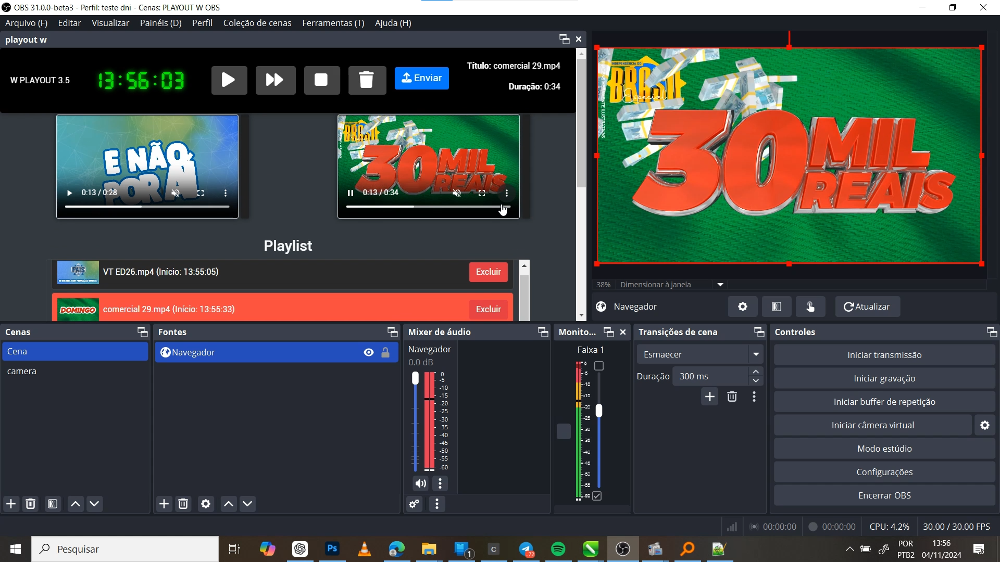

# Playout W 3.5

O **Playout W 3.5** é uma solução gratuita e completa para o gerenciamento de playlists ao vivo, ideal para quem trabalha com transmissões de vídeo em plataformas como o **OBS Studio**.
Para falar diretamente comigo, é só clicar no link do meu perfil no Telegram (o talk directly with me, just click on the link to my Telegram profile): https://t.me/asotief_designs.
## Recursos

- **Gerenciamento de Playlists:** Criação e controle de playlists de forma prática.
- **Controles de Reproduzão:** Iniciar, parar e pular vídeos com facilidade.
- **Funcionalidades de Edição:** Opções para exclusão e carregamento direto de arquivos.
- **Experiência Organizada:** Sistema projetado para garantir uma gestão eficiente.
- **Pré-visualização e Controle de Áudio:** Controle detalhado do áudio, essencial para produtores de conteúdo e emissoras.

## Benefícios

- Automação e precisão na exibição de vídeos ao vivo.
- Ideal para emissoras e criadores de conteúdo que buscam uma solução eficiente para suas transmissões.

## Vídeo

## Imagem

  <!-- Caminho relativo da sua imagem local -->

Experimente o Playout W 3.5 e leve suas transmissões ao próximo nível!
